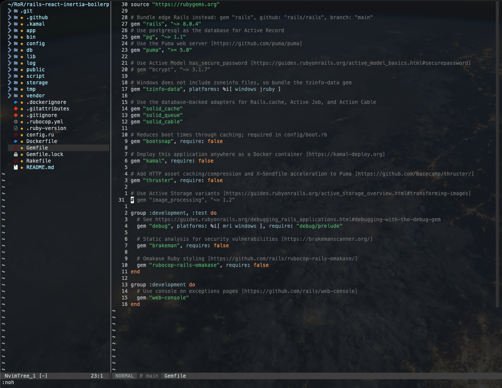
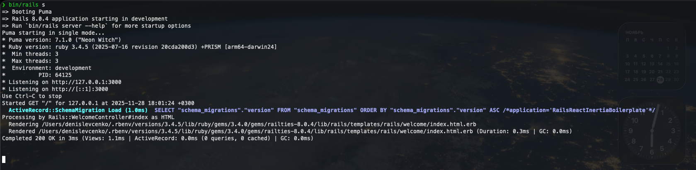
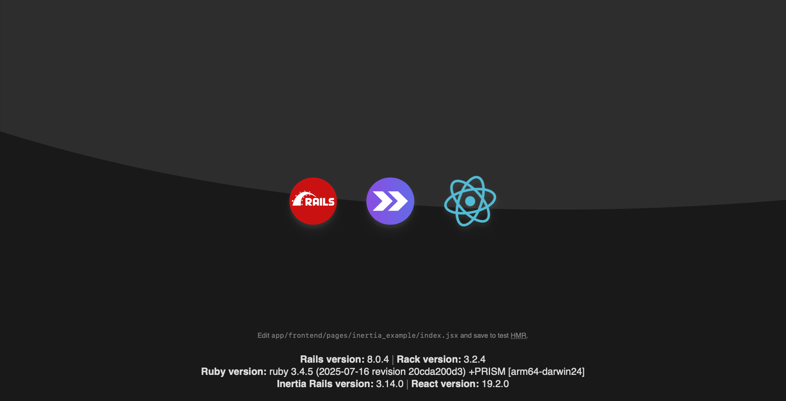
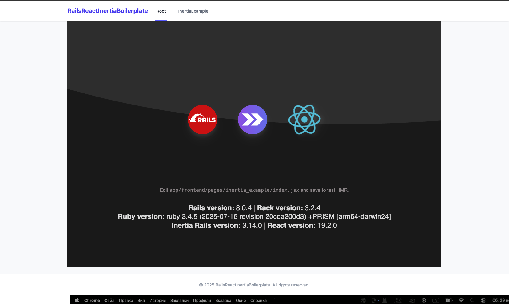
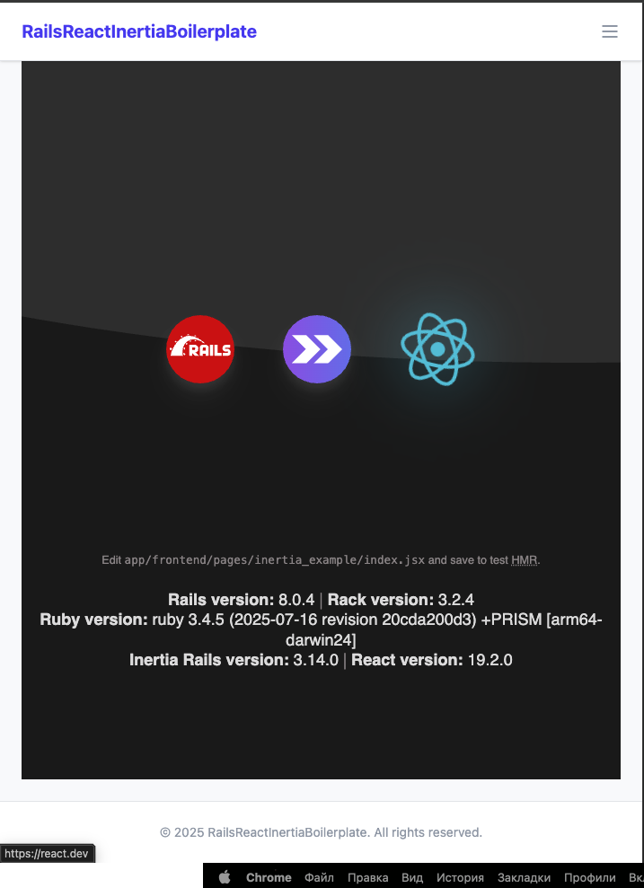
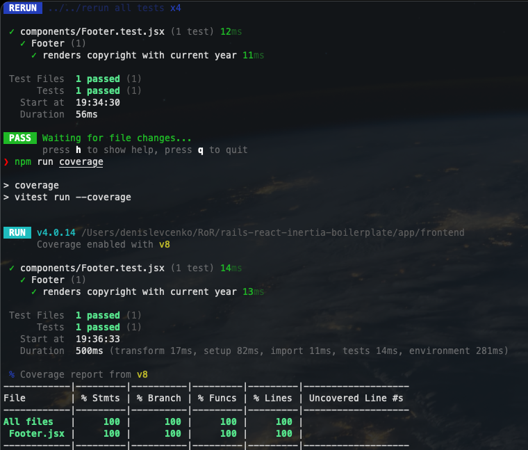
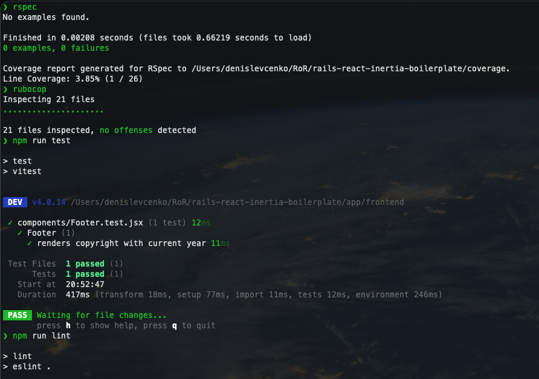

# Rails 8 + React 19 + Inertia (Solid Monolith)

<div align="center">

**Production-Ready Boilerplate**
_Rails 8 (Solid Stack) | React 19 | Vite | Inertia.js | TailwindCSS_

</div>

---

<!-- TABS NAVIGATION -->

<details open>
<summary><strong>🇬🇧 English Version (Click to expand)</strong></summary>

<br>

## Introduction

Welcome to the "Gold Standard" of modern web development. This repository is a template,
a meticulously crafted foundation for scalable and high-performance Rails applications.

This solution unifies the stability of **Rails 8** with the interactivity of **React 19**,
seamlessly connected via **Inertia.js**. Forget about complex API management, synchronizing
two repositories, or regular fixes at the backend/frontend seam. Here, the UX of an SPA,
but with the simplicity of a classic Rails monolith.

**What's inside:**

- **Backend:** Rails 8, PostgreSQL, Solid Stack (Cache/Queue/Cable in SQL), RSpec.
- **Frontend:** React 19, Vite (Instant HMR), TailwindCSS v4.
- **Quality Control:** Pre-configured RuboCop, ESLint, Prettier, Vitest.
- **Architecture:** Clean folder structure, ready for growth.

---

### Table of Contents

*   [**Part 1: The Foundation (Rails 8 Core)**](#part-1-the-foundation-rails-8-core)
*   [**Part 2: Quality Ecosystem (RSpec + RuboCop + Annotate)**](#part-2-quality-ecosystem-rspec--rubocop--annotate)
*   [**Part 3: Frontend Revolution (React + Vite + Inertia)**](#part-3-frontend-revolution-react--vite--inertia)
*   [**Part 4: Frontend Quality Ecosystem and Structure**](#part-4-frontend-quality-ecosystem-and-structure)
*   [**Part 5: Final Accord (Frontend Testing)**](#part-5-final-accord-frontend-testing)
*   [**Conclusion**](#conclusion)

---


## Part 1: The Foundation (Rails 8 Core)

Any scalable project begins with a clean slate. We won't drag along "magic" that we don't plan to use. In this part, we create the application core, ideally prepared for a modern SPA on React.

### 1. Technical Checklist

Before starting, ensure your environment is ready:

- **Ruby:** 3.4.0+
- **Rails:** 8.0.0+
- **Node.js:** 22.x (LTS)
- **PostgreSQL:** 16+ (for full Solid Stack functionality)

### 2. Project Generation

We create the application with jeweler's precision, disabling tools whose tasks will be delegated to React and Vite.

Run the commands:

```bash
  mkdir your_project_name | cd your_project_name

  rails new . \
  -d postgresql \
  --skip-jbuilder \
  --skip-test \
  --skip-system-test \
  --skip-hotwire \
  --skip-asset-pipeline \
  --skip-javascript
```

#### Argument Breakdown (Why this way?)

We are preparing the ground for **Inertia.js** and **Vite**, so we remove everything superfluous.

Explanations:

- `-d postgresql`: We use Postgres immediately. Rails 8 can store queues and cache directly in SQL (Solid Stack), and PG handles this better than SQLite in production. However, the DB and cache choice is up to you.
- `--skip-asset-pipeline`: We completely opt out of Sprockets and Propshaft. All static assets (JS, CSS, images) will be built exclusively via **Vite**.
- `--skip-javascript` & `--skip-hotwire`: We ensure that `importmap-rails`, `turbo`, and `stimulus` do not enter the project. Our frontend will be built on React, and we don't need these tools.
- `--skip-jbuilder`: Inertia passes data (props) to components directly as JSON objects; we won't need separate `.jbuilder` templates.
- `--skip-test`: We skip Minitest to cleanly implement the **RSpec** ecosystem. (This is a matter of preference, choose for yourself).

> **Note:** **Important.** We left the Views and Mailers generation. The Layout (`application.html.erb`) will become the entry point for React, and ActionMailer might be needed for sending transactional emails, for example.

> **Note:** **Possibly**, despite the `--skip-asset-pipeline` flag, Rails might create an `app/assets` folder. Since Vite will manage all our assets in a separate directory, this folder becomes a vestige. Let's remove it: `rm -rf app/assets`

> **Note:** **Also**, the Rails implementation of PWA here will only get in the way, in my opinion, as we will be building the PWA using Vite tools (if at all). So let's remove this too: `rm -rf app/views/pwa`

### 3. Configuration (Gemfile)

After running the new project generation command, my Gemfile looked like this:



The standard `Gemfile` requires modification for our stack. We will remove the unnecessary and add the required tools, grouping them logically.

Open `Gemfile` and bring it to approximately the following form:

```ruby
source "https://rubygems.org"

# --- Core Backend ---

gem "rails", "~> 8.0.4"
gem "pg", "~> 1.1"
gem "puma", ">= 5.0"
gem "bootsnap", require: false

# --- Rails 8 Solid Stack (No Redis needed!) ---

# These gems allow storing cache, queues, and sockets directly in Postgres.

# Perfect for starting - no need to spin up Redis.

gem "solid_cache"
gem "solid_queue"
gem "solid_cable"

# --- Performance & Deploy ---

# Kamal - for Docker deployment

gem "kamal", require: false

# Thruster - Go-proxy in front of Puma.

# Optional but recommended: it accelerates static asset delivery (JS/CSS bundles from Vite)

# and compresses responses (Gzip/Brotli), making the container self-sufficient without Nginx.

gem "thruster", require: false

# --- Core Frontend Stack ---

# Bridge for React components instead of Rails views

gem "inertia_rails"

# Integration of Vite (bundler) with Rails

gem "vite_rails"

# --- Utils ---

# Timezone data (needed for Windows/Docker,

# often optional on Mac/Linux, but better to keep)

gem "tzinfo-data", platforms: %i[ windows jruby ]

group :development, :test do

# Advanced debugging console (better than puts)

gem "debug", platforms: %i[ mri windows ], require: "debug/prelude"
gem "brakeman", require: false # Vulnerability scanner

# --- Testing Stack (RSpec) ---

gem "rspec-rails" # The de facto standard for tests
gem "factory_bot_rails" # Data factories
gem "faker" # Fake data generation

# Linters (Optional: we will configure them in detail later)

gem "rubocop-rails", require: false
gem "rubocop-rspec", require: false
gem "rubocop-performance", require: false

# Console for enthusiasts (optional)

gem "pry"
end

group :development do
gem "web-console" # Interactive console in the browser
gem "annotate" # DB schema documentation in models
end

group :test do
gem "simplecov", require: false # Code coverage
end

```

#### What did we do?

1.  **Removed:** `importmap-rails`, `rubocop-rails-omakase`. We will configure linting and JS building ourselves, controlling every aspect.
2.  **Added:** `vite_rails` and `inertia_rails` — these are the "heart" of our future monolith.
3.  **Kept:** `thruster`. Even in an SPA, it is useful for serving compiled assets and file uploads (X-Sendfile). For it to work in production, you need to run the server via `thrust bin/rails s`, giving a performance boost.

### 4. Installing Dependencies and Creating the Database

Since we kept the gems and dependencies for queues and cache out of the box (Solid Stack), I will configure the DB config as shown below. I have reduced the DB config to its simplest form. You can always tweak this to your preferences and tasks.

> **Note:** If you cloned this template from my repo, just do: `cp config/database.example.yml config/database.yml`. The DB config will be as below, you only need to configure the namings.

```yaml
default: &default
adapter: postgresql
encoding: unicode
pool: <%= ENV.fetch("RAILS_DATABASE_MAX_THREADS") { 5 } %>

development:
<<: \*default
database: your_project_name_development

test:
<<: \*default
database: your_project_name_test

production:
primary: &primary_production
<<: *default
database: your_project_name_production
username: your_user_name
password: <%= ENV["RAILS_DATABASE_PASSWORD"] %>
cache:
<<: *primary_production
database: your_project_name_production_cache
migrations_paths: db/cache_migrate
queue:
<<: *primary_production
database: your_project_name_production_queue
migrations_paths: db/queue_migrate
cable:
<<: *primary_production
database: your_project_name_production_cable
migrations_paths: db/cable_migrate
```

I won't configure the other configs for queues, cache, and cable within this template. Everyone can do this for their own project.

```bash
  bundle install |
  bin/rails db:create
```

If you see:

```.bash
❯ bin/rails db:create
Created database 'your_project_name_development'
Created database 'your_project_name_test'
```

It means the foundation is successfully laid.

Let's check:

```bash
  bin/rails s
```

Go to `http://127.0.0.1:3000` in the browser and see the default Rails page.

In logs:


Congratulations, we did it!

Let's commit the result:

```bash
  git init
  git add .
  git commit -m "Setup Rails 8 Core: Solid Stack, PG, RSpec prepared"
  git branch -M main
```

---

## Part 2: Quality Ecosystem (RSpec + RuboCop + Annotate)

The foundation is laid, but we need to establish a quality control system. We will ensure that any new code in our project is automatically checked for standards compliance, tests are written easily and pleasantly, and auto-generation of model documentation works.

In this part, we will configure **RSpec** (testing), **RuboCop** (linting), and **Annotate** (documentation).

### 1. RSpec Initialization

We opted out of Minitest in favor of RSpec. Now we need to create its configuration files.

Run the command:

```bash
  bin/rails generate rspec:install
```

This will create the `spec/` folder and basic configs. However, the standard settings are too "noisy" and don't include the tools we need (SimpleCov, FactoryBot). We will rewrite them from scratch.

#### Configuring `.rspec`

This file is responsible for test execution parameters. We want to see beautiful colored output.

Open `.rspec` and configure it to your liking. I usually use this set of arguments:

```text
--format documentation
--color
--require rails
```

#### Configuring `spec/rails_helper.rb`

This is the main test configuration file. We will configure it to:

1.  Run **SimpleCov** (code coverage) _before_ loading Rails.
2.  Filter out unnecessary noise from reports.
3.  Connect **FactoryBot** (to write `create(:user)` instead of `FactoryBot.create(:user)`).
4.  Connect **Inertia** helpers (for component testing).

Completely replace the content of `spec/rails_helper.rb` with the following:

```ruby
# frozen_string_literal: true

require 'spec_helper'
require 'simplecov'

# Start code coverage analysis

SimpleCov.start 'rails' do

  # Exclude technical directories from the report

  add_filter '/bin/'
  add_filter '/db/'
  add_filter '/spec/'
  add_filter '/config/'

  # Group files in the report for convenience

  add_group 'Controllers', 'app/controllers'
  add_group 'Models', 'app/models'
  add_group 'Mailers', 'app/mailers'
  add_group 'Libraries', 'lib'
end

ENV['RAILS_ENV'] ||= 'test'
require_relative '../config/environment'

# Protect against running tests on the production database

abort('The Rails environment is running in production mode!') if Rails.env.production?

require 'rspec/rails'
require 'inertia_rails/rspec'

begin
  ActiveRecord::Migration.maintain_test_schema!
rescue ActiveRecord::PendingMigrationError => e
  abort e.to_s.strip
end

RSpec.configure do |config|
  # Specify path to fixtures (though we will use factories)

  config.fixture_paths = [Rails.root.join('spec/fixtures')]

  # Transactional tests: database is cleaned after each test

  config.use_transactional_fixtures = true

  # Remove extra noise from stack traces

  config.filter_rails_from_backtrace!

  # Include FactoryBot syntax (create, build, attributes_for)

  config.include FactoryBot::Syntax::Methods
end
```

> **Note:** **Important.** This is a minimal working config, further customization depends on your project and preferences.

Don't forget to add the coverage folder to `.gitignore` so reports don't fly into the repository:

```bash
  echo "coverage" >> .gitignore
```

### 2. RuboCop Configuration (Linter)

RuboCop "out of the box" can be too strict or, conversely, miss important things. We will configure a balanced config that helps maintain code cleanliness without suffocating with bureaucracy.

Create a `.rubocop.yml` file in the project root if it's missing:

```yaml
plugins:

- rubocop-rails
- rubocop-rspec
- rubocop-performance

AllCops:
TargetRubyVersion: 3.4
NewCops: enable
SuggestExtensions: false
Exclude:

- 'bin/\*_/_'
- 'db/\*_/_' # Schemas and migrations often fail checks, and that's normal
- 'tmp/\*_/_'
- 'config/initializers/\*_/_' # Initializers often have specific DSL
- 'node_modules/\*_/_'
- 'vendor/\*_/_'

# Rails specific

Rails/UnknownEnv:
Environments:

- production
- development
- test
- staging

# Documentation: In fast-paced projects, 100% class documentation is often redundant

Style/Documentation:
Enabled: false

# Frozen String: In Ruby 3+ this is the norm, but explicit indication is useful

Style/FrozenStringLiteralComment:
Enabled: true

# RSpec: Give tests a bit more freedom

RSpec/ExampleLength:
Max: 20 # Integration tests can be longer than units

RSpec/MultipleExpectations:
Max: 5 # Checking status, headers, and response body in one test is ok

# Layout: Modern monitors are wide

Layout/LineLength:
Max: 120
```

> **Note:** **Also,** you can customize this to your preferences.

### 3. Generators Configuration (Clean Architecture)

We want the command `rails g model User` to create only the necessary files, not a pile of garbage (assets, helpers, view tests) that we don't use since our entire front end is on React.

Open `config/application.rb` and add this configuration block inside the `YourApplication` class:

```ruby
    # ... inside class YourApplication < Rails::Application ...

    # Generator configuration for project cleanliness
    config.generators do |g|
      g.test_framework :rspec,
                       fixtures: true,
                       view_specs: false,    # In Inertia, views are tested via JS tests or system specs
                       helper_specs: false,  # Helpers are rarely needed, logic is better kept in models
                       routing_specs: false, # Routing is checked in request specs
                       request_specs: true   # Our main tool for API testing

      g.fixture_replacement :factory_bot, dir: "spec/factories"

      g.stylesheets false      # Styles in Tailwind (Vite)
      g.javascripts false      # JS in React (Vite)
      g.helper false           # Global helpers are not needed
      g.channel assets: false  # Channels without extra files
    end
```

> **Note:** **Possibly** you might want to change this somehow, at your discretion.

### 4. Annotate Configuration (DB Documentation)

The `annotate` gem allows automatically adding comments with the table schema to the beginning of each model file. This is very convenient: open a model, for example `User.rb`, and immediately see what fields it has.

Let's install auto-annotation. Run:

```bash
  bin/rails g annotate:install
```

This will create the file `lib/tasks/auto_annotate_models.rake`. Its default settings are good, but make sure `Annotate.load_tasks` is called at the end if you want to run it manually. The main magic happens automatically after `db:migrate` in the development environment.

### 5. System Check

Now that everything is configured, let's make sure the system works.

1.  **Linter Check:**

    ```bash
    bundle exec rubocop
    ```

    Most likely, it will find "violations" in auto-generated files (e.g., double quotes). Fix them automatically:

    ```bash
    bundle exec rubocop -A
    ```

2.  **Test Check:**

    ```bash
    bundle exec rspec
    ```

    You should see `No examples found`, but the command should complete successfully (green color). This means RSpec is ready to work.

3.  **Security Check (Brakeman):**

    ```bash
    bundle exec brakeman
    ```

    You should see a report `No warnings found`. This means the basic Rails config is secure. The beauty of Brakeman is that it requires no configuration, it simply works "out of the box".

4.  **Commit Result:**

    ```bash
    git add .
    git commit -m "Setup Quality Ecosystem: RSpec, RuboCop, SimpleCov"
    ```

---

Congratulations!

**Step 2 is complete.** Our Backend now represents a professional development environment. It is protected by tests, code is checked against standards, and generators are now our helpers.

---

## Part 3: Frontend Revolution (React + Vite + Inertia)

The times when integrating React into Rails took hours and required editing dozens of configs are over. In 2025, tools have become so smart they understand each other perfectly.

In this part, we will deploy a full-fledged modern frontend stack with one command, and then "polish" its settings for ideal operation.

### 1. Magic Command

Ensure you are in the project root. So, we don't need to install Vite or React manually. The `inertia_rails` gem, which we added earlier, has a powerful installer.

Just run:

```bash
  bin/rails g inertia:install
```

Now watch the questions in the terminal carefully and answer them:

1.  **"Could not find a package.json... Would you like to install Vite Ruby?"** -> `y` (Yes!)
    - _The generator realized we don't have a bundler and offered to install Vite itself._
2.  **"Would you like to use TypeScript?"** -> `n` (No)
    - _For the start, we choose JS. If you are a TS guru — choose `y`._
3.  **"Would you like to install Tailwind CSS?"** -> `y` (Yes!)
    - _Tailwind will install and configure itself automatically._
4.  **"What framework do you want to use with Inertia?"** -> `react`
    - _We choose our UI engine._
5.  **"Overwrite bin/dev?"** -> `y` (Yes!)
    - _The generator will update the launch script to bring up both Rails and Vite with one command._

**That's it !!!**

> Wait, was it that simple?

### 2. Polishing and Fine-tuning

The generator did 90% of the work, but left a few moments that we, as perfectionists, must fix.

#### Removing extra entrypoints

The generator created `app/frontend/entrypoints/inertia.jsx` (our real entry point) and left the default `app/frontend/entrypoints/application.js` (from Vite). We don't need the latter, as it will only confuse things.

Delete the file `app/frontend/entrypoints/application.js`.

Now open `app/views/layouts/application.html.erb` and bring the `<head>` section to this clean look:

```erb
  <head>
    <title data-inertia><%= content_for(:title) || "Rails React Inertia Boilerplate" %></title>
    <meta name="viewport" content="width=device-width,initial-scale=1">

    <%= csrf_meta_tags %>
    <%= csp_meta_tag %>
    <%= yield :head %>

    <%# Connect styles via Vite (so they are hot-reloaded) %>
    <%= vite_stylesheet_tag "application" %>

    <%# Connect React HMR and our entry point %>
    <%= vite_react_refresh_tag %>
    <%= vite_client_tag %>
    <%= vite_javascript_tag "inertia.jsx" %>

    <%# SSR head (if needed in the future) %>
    <%= inertia_ssr_head %>

  </head>
```

> **Note:** **Pay attention:** We removed `vite_javascript_tag 'application'`, leaving only `inertia.jsx`. This makes loading understandable and predictable.

#### Basic Inertia Controller

The generator created the file `app/controllers/inertia_controller.rb`. This is the base controller from which all controllers using React should inherit.

Open it and ensure it looks like this:

```ruby
# frozen_string_literal: true

class InertiaController < ApplicationController
  # Automatically pass flash messages (notice, alert) to React props
  inertia_share flash: -> { flash.to_hash }
end
```

Now, when creating new controllers for the frontend, inherit from `InertiaController`, not `ApplicationController`.

#### Configuring Procfile.dev

Open the `Procfile.dev` file in the root. It manages development processes. Let's make it clearer:

```bash
# 1. Rails (Main process).
# RUBY_DEBUG_OPEN=true enables remote debugging.
# Since foreman captures input, we can't write commands directly here.
# But with this flag, you can connect to the debugger from a neighboring terminal: rdbg -a
# Just place a `debugger` breakpoint somewhere in the code beforehand.
web: env RUBY_DEBUG_OPEN=true bin/rails server

# 2. Vite (Frontend bundler).
# Runs in parallel and updates JS/CSS on the fly (HMR).
vite: bin/vite dev
```

> **Note:** **Why is `web` first?** This is a convention. If the main process (Rails) fails, foreman will stop Vite too.

#### Routing

In `config/routes.rb`, the generator added a useful block to redirect from 127.0.0.1 to localhost (so Vite doesn't complain about CORS). Keep it, it's useful:

```ruby
Rails.application.routes.draw do
  # Redirect to localhost from 127.0.0.1 to use same IP address with Vite server
  constraints(host: '127.0.0.1') do
    get '(*path)', to: redirect { |params, req| "#{req.protocol}localhost:#{req.port}/#{params[:path]}" }
  end

  # Demo routes, useful for checking frontend operation (can be removed later)
  root 'inertia_example#index'
  get 'inertia-example', to: 'inertia_example#index'
end
```

### 3. Launch

Everything is ready. Start the development server:

```bash
  bin/dev
```

Open `http://127.0.0.1:3000`. You will see a working application.



Congratulations!

### 4. Commit

Let's commit our victory:

```bash
  git add .
  git commit -m "Frontend Setup: Vite + React + Inertia (Auto-generated & Polished)"
```

---

**Step 3 is complete.** We got a working frontend, configured intelligently.

---

## Part 4: Frontend Quality Ecosystem and Structure

We configured the "engine" (Vite), now it's time to furnish the "interior". We won't dump all files into one pile, but immediately organize a professional architecture, configure aliases for imports, and connect strict code quality standards (Linter & Formatter).

### 1. Architecture (Folders)

In `app/frontend` create a structure ready for scaling. We divide the application into logical layers:

```bash
  # Components: reusable UI elements (Header, Footer, Buttons)
  mkdir -p app/frontend/components

  # Layouts: page wrappers (Persistent Layouts)
  mkdir -p app/frontend/layouts

  # Utils: helper functions
  mkdir -p app/frontend/utils
```

> **Note:** This is the simplest division; generally, everyone has their own approach here.

### 2. Configuring Aliases (Imports)

To avoid writing endless `../../../components/Button`, let's configure the alias `@` for the root `app/frontend`. This is the de facto standard in modern JS.

Open `vite.config.ts` and add the `resolve` section:

```ts
// @ts-ignore
import react from '@vitejs/plugin-react'
// @ts-ignore
import tailwindcss from '@tailwindcss/vite'
import { defineConfig } from 'vite'
import RubyPlugin from 'vite-plugin-ruby'
// @ts-ignore
import { fileURLToPath, URL } from 'url'

export default defineConfig({
  plugins: [react(), tailwindcss(), RubyPlugin()],
  resolve: {
    alias: {
      // @ts-ignore
      '@': fileURLToPath(new URL('./app/frontend', import.meta.url)),
    },
  },
})
```

### 3. Global Layout and Components

In classic React (SPA) we have `App.jsx` where we wrap routes. In Inertia, we use a **Global Resolver**. We will teach the application to automatically wrap any page in `MainLayout`, unless the page requested otherwise.

#### 3.1 Entry Point (`entrypoints/inertia.jsx`)

Open `app/frontend/entrypoints/inertia.jsx`. We add the default layout "magic" here:

```jsx
import { createInertiaApp } from '@inertiajs/react'
import { StrictMode } from 'react'
import { createRoot } from 'react-dom/client'
import MainLayout from '@/layouts/MainLayout'

createInertiaApp({
  resolve: (name) => {
    const pages = import.meta.glob('../pages/**/*.jsx', {
      eager: true,
    })
    const page = pages[`../pages/${name}.jsx`]

    if (!page) {
      console.error(`Missing Inertia page component: '${name}.jsx'`)
    }

    // Magic: If the page doesn't have its own layout, assign MainLayout
    page.default.layout = page.default.layout || ((page) => <MainLayout>{page}</MainLayout>)

    return page
  },
  // ... setup code
})
```

#### 3.2 MainLayout (`layouts/MainLayout.jsx`)

Now create the Layout itself, which is assembled from components.

```jsx
import Header from '@/components/Header'
import Footer from '@/components/Footer'

export default function MainLayout({ children }) {
  return (
    <div className="flex min-h-screen flex-col bg-gray-50 font-sans text-gray-900">
      <Header />

      <main className="flex-grow">
        <div className="mx-auto max-w-7xl py-6 sm:px-6 lg:px-8">{children}</div>
      </main>

      <Footer />
    </div>
  )
}
```

#### 3.3 Interface Components

We decompose the interface into atomic parts.

**Footer (`components/Footer.jsx`):**

```jsx
export default function Footer() {
  return (
    <footer className="mt-auto border-t border-gray-200 bg-white">
      <div className="mx-auto max-w-7xl px-4 py-6 sm:px-6 lg:px-8">
        <p className="text-center text-sm text-gray-400">
          &copy; {new Date().getFullYear()} RailsReactInertiaBoilerplate. All rights reserved.
        </p>
      </div>
    </footer>
  )
}
```

**Header (`components/Header.jsx`):**
Navigation and mobile menu logic live here.

```jsx
import { useState } from 'react'
import { Link, usePage } from '@inertiajs/react'
import { getNavLinkClasses } from '@/utils/navLinksHelpers'
import BurgerButton from '@/components/BurgerButton'

export default function Header() {
  const [isMobileMenuOpen, setIsMobileMenuOpen] = useState(false)
  const { url } = usePage()

  return (
    <nav className="sticky top-0 z-50 border-b border-gray-200 bg-white shadow-sm">
      <div className="mx-auto max-w-7xl px-4 sm:px-6 lg:px-8">
        <div className="flex h-16 justify-between">
          {/* Logo + Desktop */}
          <div className="flex">
            <div className="flex flex-shrink-0 items-center">
              <Link
                href="/"
                className="text-xl font-bold text-indigo-600 transition hover:text-indigo-500"
              >
                RailsReactInertiaBoilerplate
              </Link>
            </div>
            <div className="hidden md:ml-6 md:flex md:space-x-8">
              <Link href="/" className={getNavLinkClasses(url, '/')}>
                Root
              </Link>
              <Link href="/inertia-example" className={getNavLinkClasses(url, '/inertia-example')}>
                InertiaExample
              </Link>
            </div>
          </div>

          {/* Hamburger */}
          <BurgerButton
            isOpen={isMobileMenuOpen}
            onToggle={() => setIsMobileMenuOpen(!isMobileMenuOpen)}
          />
        </div>
      </div>

      {/* Mobile Menu */}
      {isMobileMenuOpen && (
        <div className="border-t border-gray-200 md:hidden">
          <div className="space-y-1 pt-2 pb-3">
            <Link
              href="/"
              className={getNavLinkClasses(url, '/', true)}
              onClick={() => setIsMobileMenuOpen(false)}
            >
              Root
            </Link>
            <Link
              href="/inertia-example"
              className={getNavLinkClasses(url, '/inertia-example', true)}
              onClick={() => setIsMobileMenuOpen(false)}
            >
              InertiaExample
            </Link>
          </div>
        </div>
      )}
    </nav>
  )
}
```

**BurgerButton (`components/BurgerButton.jsx`):**

```jsx
export default function BurgerButton({ isOpen, onToggle }) {
  return (
    <div className="-mr-2 flex items-center md:hidden">
      <button onClick={onToggle} className="burger-btn">
        <span className="sr-only">{isOpen ? 'Close main menu' : 'Open main menu'}</span>
        <svg
          className="block h-6 w-6"
          xmlns="http://www.w3.org/2000/svg"
          fill="none"
          viewBox="0 0 24 24"
          stroke="currentColor"
        >
          <path
            strokeLinecap="round"
            strokeLinejoin="round"
            strokeWidth="2"
            d={isOpen ? 'M6 18L18 6M6 6l12 12' : 'M4 6h16M4 12h16M4 18h16'}
          />
        </svg>
      </button>
    </div>
  )
}
```

### 4. Utils and Styles (CSS Layers)

To avoid duplicating class logic and cluttering JSX with Tailwind class "walls", we use two approaches.

#### 4.1 Navigation Helper (`utils/navLinksHelpers.js`)

```js
export const getNavLinkClasses = (currentUrl, path, isMobile = false) => {
  const isActive = currentUrl === path || (path !== '/' && currentUrl.startsWith(path))

  if (isMobile) {
    return `mobile-nav-link ${isActive ? 'mobile-nav-link-active' : 'mobile-nav-link-inactive'}`
  }

  return `nav-link ${isActive ? 'nav-link-active' : 'nav-link-inactive'}`
}
```

#### 4.2 CSS Layers (`assets/application.css`)

We move long class sets to CSS using the `@apply` directive.

```css
@import 'tailwindcss';

@plugin '@tailwindcss/typography';
@plugin '@tailwindcss/forms';

@layer components {
  /* Desktop menu links */
  .nav-link {
    @apply inline-flex items-center border-b-2 px-1 pt-1 text-sm font-medium transition duration-150 ease-in-out;
  }
  .nav-link-active {
    @apply border-indigo-500 text-gray-900;
  }
  .nav-link-inactive {
    @apply border-transparent text-gray-500 hover:border-indigo-500 hover:text-gray-900;
  }

  /* Mobile menu links */
  .mobile-nav-link {
    @apply block border-l-4 py-2 pr-4 pl-3 text-base font-medium transition duration-150 ease-in-out;
  }
  .mobile-nav-link-active {
    @apply border-indigo-500 bg-indigo-50 text-indigo-700;
  }
  .mobile-nav-link-inactive {
    @apply border-transparent text-gray-600 hover:border-gray-300 hover:bg-gray-50 hover:text-gray-800;
  }

  /* Burger menu */
  .burger-btn {
    @apply inline-flex items-center justify-center rounded-md p-2 text-gray-400;
    @apply hover:bg-gray-100 hover:text-gray-500 focus:ring-2 focus:outline-none focus:ring-inset;
    @apply transition duration-150 ease-in-out focus:ring-indigo-500;
  }
}
```

We wrapped the test launch page in our default layouts. Styles and all configs are working properly.
Congratulations!
Everything works perfectly and we demonstrated it.

Here is the result:





### 5. Quality Ecosystem (Prettier + ESLint)

Code should not only be working but also beautiful. Let's configure automatic formatting and linting.

#### 5.1 Prettier (Formatting)

First, install Prettier and the plugin for Tailwind.

Run the command:

```bash
  npm install -D prettier prettier-plugin-tailwindcss
```

Create a `.prettierrc` file.
For example:

```json
{
  "semi": false,
  "singleQuote": true,
  "tabWidth": 2,
  "useTabs": false,
  "trailingComma": "es5",
  "printWidth": 100,
  "plugins": ["prettier-plugin-tailwindcss"]
}
```

#### 5.2 ESLint (Code Quality)

Install ESLint and plugins for React.

Run the command:

```bash
  npm install -D eslint eslint-plugin-react eslint-plugin-react-hooks eslint-plugin-react-refresh eslint-config-prettier globals
```

Create config `eslint.config.js`
For example:

```js
import js from '@eslint/js'
import globals from 'globals'
import react from 'eslint-plugin-react'
import reactHooks from 'eslint-plugin-react-hooks'
import reactRefresh from 'eslint-plugin-react-refresh'
import prettier from 'eslint-config-prettier'

export default [
  { ignores: ['public', 'coverage', 'node_modules'] },
  {
    files: ['**/*.{js,jsx}'],
    languageOptions: {
      ecmaVersion: 2020,
      globals: globals.browser,
      parserOptions: {
        ecmaVersion: 'latest',
        ecmaFeatures: { jsx: true },
        sourceType: 'module',
      },
    },
    settings: { react: { version: '18.3' } },
    plugins: {
      react,
      'react-hooks': reactHooks,
      'react-refresh': reactRefresh,
    },
    rules: {
      ...js.configs.recommended.rules,
      ...react.configs.recommended.rules,
      ...react.configs['jsx-runtime'].rules,
      ...reactHooks.configs.recommended.rules,
      'react/prop-types': 'off',
      'react-refresh/only-export-components': ['warn', { allowConstantExport: true }],
    },
  },
  {
    files: ['**/*.test.{js,jsx}', '**/test/setup.js'],
    languageOptions: {
      globals: {
        describe: 'readonly',
        it: 'readonly',
        expect: 'readonly',
        vi: 'readonly',
        afterEach: 'readonly',
        global: 'writable',
      },
    },
  },
  prettier,
]
```

#### 5.3 Launch Scripts

Add commands to run linters in `package.json` (`scripts` section):

```json
{
  "scripts": {
    "build": "vite build",
    "format": "prettier --write .",
    "lint": "eslint .",
    "lint:fix": "eslint . --fix"
  }
}
```

### 6. Commit

Now let's bring the whole project to a uniform style and commit the result.

```bash
# Format code
  npm run format

  # Fix errors (automatically)
  npm run lint:fix

  # Commit
  git add .
  git commit -m "Frontend Quality: Architecture, Aliases, Global Layout, CSS Layers, Linters"
```

---

**Step 4 is complete.** We created a professional frontend architecture and protected the codebase with strict linting rules and set a good style tone for the project. Now we can move on to setting up the test environment.

## Part 5: Final Accord (Frontend Testing)

We built a powerful monolith, configured linters and architecture. The last touch distinguishing a professional project from a craft is **Tests**.

For Rails, we already configured RSpec. For React, we will use **Vitest**.
Because we use **Vite**. Also, **Vitest** is a modern, blazing fast replacement for Jest that uses the same `vite.config.ts` as your application.
This means: fewer configs, faster launch, full compatibility.

### 1. Installing Dependencies

We will need the runner itself (Vitest), a browser emulation environment (jsdom), and a library for testing React components.

Run:

```bash
  npm install -D vitest jsdom @testing-library/react @testing-library/jest-dom @vitest/coverage-v8
```

### 2. Configuring Vite Config

We need to make Vite "friends" with tests. Open `vite.config.ts` and add the `test` section.

```ts
// ... your imports (react, tailwindcss, ruby, url)

export default defineConfig({
  plugins: [react(), tailwindcss(), RubyPlugin()],
  resolve: {
    alias: {
      '@': fileURLToPath(new URL('./app/frontend', import.meta.url)),
    },
  },
  // Adding test section
  // @ts-ignore
  test: {
    globals: true, // Allows using describe, it, expect without import
    environment: 'jsdom', // Emulate browser (DOM)
    setupFiles: 'test/setup.js', // Setup file
    css: true, // Process CSS (useful if classes affect logic)
  },
})
```

> **Note:** TypeScript might complain about the `test` property. To fix this, add `// @ts-ignore` before the key.

### 3. Setup File

Let's create a test config `app/frontend/test/setup.js`. We will do a minimal setup for now.

```js
import '@testing-library/jest-dom'
import { cleanup } from '@testing-library/react'
import { afterEach } from 'vitest'

// Clean DOM after each test
afterEach(() => {
  cleanup()
})

// Global mocks (if needed). For example, for ResizeObserver, which is missing in jsdom.
global.ResizeObserver = class ResizeObserver {
  observe() {}
  unobserve() {}
  disconnect() {}
}
```

### 4. Launch Scripts

Add convenient commands to `package.json`:

```json
{
  "scripts": {
    "test": "vitest",
    "test:ui": "vitest --ui",
    "coverage": "vitest run --coverage",
    "build": "vite build",
    "format": "prettier --write .",
    "lint": "eslint .",
    "lint:fix": "eslint . --fix"
  }
}
```

### 5. First Test

Let's check that everything works. We'll write a test for our `Footer` component.

Create file `app/frontend/components/Footer.test.jsx`:

```jsx
import { render, screen } from '@testing-library/react'
import { describe, it, expect } from 'vitest'
import Footer from './Footer'

describe('Footer', () => {
  it('renders copyright with current year', () => {
    render(<Footer />)

    const currentYear = new Date().getFullYear()

    // Check that copyright text is present
    expect(screen.getByText(/RailsReactInertiaBoilerplate/i)).toBeInTheDocument()

    // Check that the year is current
    expect(screen.getByText(new RegExp(currentYear.toString()))).toBeInTheDocument()
  })
})
```

### 6. Launch

Now the moment of truth.

```bash
  npm run test
```

You should see a green result:

```.bash
 ✓ app/frontend/components/Footer.test.jsx (1)
   ✓ Footer > renders copyright with current year

 Test Files  1 passed (1)
      Tests  1 passed (1)
```

If you want to see a beautiful code coverage report:

```bash
  npm run coverage
```

Here is how it was for me:



Also, let's run everything we have at the moment.



### 7. Commit

Congratulations! We created a full-fledged test environment for the frontend.

Let's commit this.

```bash
  git add .
  git commit -m "Frontend Testing: Vitest, JSDOM, Testing Library setup"
```

---

## Conclusion

Excellent! You have just created the **"Gold Standard"** of a web application in 2025 on Rails, which possesses all the pros of a native, cozy monolith and a fast, flexible SPA on React all in one bottle. This is cool!

What we have in the dry run:

1.  **Backend:** Rails 8 (Solid Stack) + Postgres + RSpec. Clean, powerful, without Redis and other dependencies.
2.  **Frontend:** React 19 + Vite + Tailwind v4. Instant build and modern DX.
3.  **Glue:** Inertia.js. The feeling of an SPA without the pain of creating an API and with all the pros of the familiar Rails monolith.
4.  **Quality:** Full set of linters (RuboCop, ESLint, Prettier) and tests (RSpec, Vitest).
5.  **Architecture:** Thought-out directory structure and aliases.

This template is the ideal starting point for any SaaS, marketplace, or complex CRM. You don't spend days setting up and regular fixes at the backend/frontend level — you just write business logic.

**Happy Coding!** 🚀

</details>

<details>
<summary><strong>🇷🇺 Русская версия (Нажми, чтобы открыть)</strong></summary>

<br>

## Введение

Добро пожаловать в «Золотой стандарт» современной веб-разработки. Этот репозиторий — шаблон,
тщательно выверенный фундамент для масштабируемых и производительных приложений на Rails.

В этом решении объеденены стабильность **Rails 8** с интерактивностью **React 19**, они бесшовно связаны
через **Inertia. js**. Забудьте о сложном управлении API, синхронизации двух репозиториев, регулярных фиксах на
стыке бэка и фронта. Здесь UX как в SPA, но с простотой классического Rails-монолита.

**Что внутри:**

- **Backend:** Rails 8, PostgreSQL, Solid Stack (кэш/очереди прямо в SQL), RSpec.
- **Frontend:** React 19, Vite (мгновенный HMR), TailwindCSS v4.
- **Контроль качества:** Настроенные RuboCop, ESLint, Prettier, Vitest.
- **Архитектура:** Чистая структура папок, готовая к росту.

---

### Содержание

*   [**Часть 1: Фундамент (Rails 8 Core)**](#часть-1-фундамент-rails-8-core)
*   [**Часть 2: Экосистема Качества (RSpec + RuboCop + Annotate)**](#часть-2-экосистема-качества-rspec--rubocop--annotate)
*   [**Часть 3: Фронтенд-Революция (React + Vite + Inertia)**](#часть-3-фронтенд-революция-react--vite--inertia)
*   [**Часть 4: Экосистема Качества Фронтенда и Структура**](#часть-4-экосистема-качества-фронтенда-и-структура)
*   [**Часть 5: Финальный Аккорд (Тестирование Фронтенда)**](#часть-5-финальный-аккорд-тестирование-фронтенда)
*   [**Заключение**](#заключение)

---

## Часть 1: Фундамент (Rails 8 Core)

Любой масштабируемый проект начинается с чистого листа. Мы не будем тащить за собой "магию",
которую не планируем использовать. В этой части мы создадим ядро приложения, идеально подготовленное
для современного SPA на React.

### 1. Технический чек-лист

Перед стартом убедитесь, что ваше окружение готово к работе:

- **Ruby:** 3.4.0+
- **Rails:** 8.0.0+
- **Node.js:** 22.x (LTS)
- **PostgreSQL:** 16+ (для полноценной работы Solid Stack)

### 2. Генерация проекта

Мы создаем приложение с ювелирной точностью, отключая инструменты, задачи которых возложим на React и Vite.

Выполните команды:

```bash
  mkdir your_project_name | cd your_project_name

  rails new . \
    -d postgresql \
    --skip-jbuilder \
    --skip-test \
    --skip-system-test \
    --skip-hotwire \
    --skip-asset-pipeline \
    --skip-javascript
```

#### Разбор аргументов (Почему именно так?)

Мы готовим почву для **Inertia.js** и **Vite**, поэтому убираем все лишнее.

Пояснения аргументов:

- `-d postgresql`: Сразу используем Postgres. Потому что, например, Rails 8 умеет хранить очереди и кэш
  прямо в SQL (Solid Stack), и PG справляется с этим лучше SQLite в продакшене. Но имейте в виду, БД и кэш на вше
  усмотрение.
- `--skip-asset-pipeline`: Мы полностью отказываемся от Sprockets и Propshaft. Вся статика (JS, CSS, картинки)
  будет собираться исключительно через **Vite**.
- `--skip-javascript` & `--skip-hotwire`: Мы гарантируем, что в проект не попадут `importmap-rails`, `turbo` и
  `stimulus`. Наш фронтенд будет строиться на React, и нам не нужны эти инструменты.
- `--skip-jbuilder`: Inertia передает данные (props) в компоненты напрямую как JSON-объекты,
  отдельные шаблоны `.jbuilder` нам не понадобятся.
- `--skip-test`: Пропускаем Minitest, чтобы начисто внедрить экосистему **RSpec**. (Это все же на любителя,
  выбирайте сами)

> **Note:** **Важно.** Мы оставили генерацию Views и Mailers. Layout (`application.html.erb`)
> станет точкой входа для React, а ActionMailer может понадобиться, для отправки транзакционных писем, например.

> **Note:** **Возможно**, несмотря на флаг `--skip-asset-pipeline`, Rails создаст папку `app/assets`. Поскольку всеми
> ассетами у нас будет управлять Vite в отдельной директории, эта папка становится ненужным рудиментом. Удалим ее:
> `rm -rf app/assets`

> **Note:** **Так же**, Rails-реализация PWA здесь будет только мешать, по моему мнению, так как мы будем строить PWA
> уже средствами Vite (если вообще будем). По этому удалим и это тоже:
> `rm -rf app/views/pwa`

### 3. Настройка (Gemfile)

У меня, после выполнения команды генерации нового проекта, Gemfile имел такой вид


Стандартный `Gemfile` требует доработки под наш стек.
Мы удалим лишнее и добавим нужные инструменты, сгруппировав их по смыслу.

Откройте `Gemfile` и приведите его примерно к следующему виду:

```ruby
source "https://rubygems.org"

# --- Core Backend ---
gem "rails", "~> 8.0.4"
gem "pg", "~> 1.1"
gem "puma", ">= 5.0"
gem "bootsnap", require: false

# --- Rails 8 Solid Stack (No Redis needed!) ---
# Эти гемы позволяют хранить кэш, очереди и сокеты прямо в Postgres.
# Это идеально для старта - не нужно поднимать Redis.
gem "solid_cache"
gem "solid_queue"
gem "solid_cable"

# --- Performance & Deploy ---
# Kamal - для деплоя в Docker
gem "kamal", require: false

# Thruster - Go-прокси перед Puma.
# Опционально, но рекомендуется: он ускоряет отдачу статики (JS/CSS бандлов от Vite)
# и сжимает ответы (Gzip/Brotli), делая контейнер самодостаточным без Nginx.
gem "thruster", require: false

# --- Core Frontend Stack ---
# Мост для React-компонентов вместо Rails-вьюх
gem "inertia_rails"
# Интеграция Vite (сборщик) с Rails
gem "vite_rails"

# --- Utils ---
# Данные о часовых поясах (нужен для Windows/Docker,
# на Mac/Linux часто опционален, но лучше оставить)
gem "tzinfo-data", platforms: %i[ windows jruby ]

group :development, :test do
  # Продвинутая консоль дебаггинга (лучше чем puts)
  gem "debug", platforms: %i[ mri windows ], require: "debug/prelude"
  gem "brakeman", require: false # Сканер уязвимостей

  # --- Testing Stack (RSpec) ---
  gem "rspec-rails"       # Стандарт де-факто для тестов
  gem "factory_bot_rails" # Фабрики данных
  gem "faker"             # Генерация фейковых данных

  # Линтеры (Опционально: мы будем настраивать их детально позже)
  gem "rubocop-rails", require: false
  gem "rubocop-rspec", require: false
  gem "rubocop-performance", require: false

  # Консоль для любителей (опционально)
  gem "pry"
end

group :development do
  gem "web-console" # Интерактивная консоль в браузере
  gem "annotate" # Документация схемы БД в моделях
end

group :test do
  gem "simplecov", require: false # Покрытие кода
end
```

#### Что мы сделали?

1.  **Убрали:** `importmap-rails`, `rubocop-rails-omakase`.
    Мы будем настраивать линтинг и JS-сборку сами, контролируя каждый аспект.
2.  **Добавили:** `vite_rails` и `inertia_rails` — это "сердце" нашего будущего монолита.
3.  **Оставили:** `thruster`. Даже в SPA он полезен для отдачи скомпилированных ассетов и загрузки файлов (X-Sendfile).
    Для его работы в продакшене нужно запускать сервер через `thrust bin/rails s`, это дает прирост
    производительности.

### 4. Устанавливаем зависимости и создаем базу данных

Так как мы оставили в проекте гемы и зависимости для очередей и кеша из коробки (Solid Stack),
то я настрою конфиг для БД как показано ниже.
Я привел конфиг для БД в самый простой вид. Вы всегда можете подкрутить это под ваши предпочтения и задачи.

> Note: если вы клонировали данный шаблон из моей репы, то просто сделайте так:
> `cp config/database.example.yml config/database.yml`
> конфиг для БД будет как указано ниже, необходимо будет настроить только нэйминги

```yaml
default: &default
  adapter: postgresql
  encoding: unicode
  pool: <%= ENV.fetch("RAILS_DATABASE_MAX_THREADS") { 5 } %>

development:
  <<: *default
  database: your_project_name_development

test:
  <<: *default
  database: your_project_name_test

production:
  primary: &primary_production
    <<: *default
    database: your_project_name_production
    username: your_user_name
    password: <%= ENV["RAILS_DATABASE_PASSWORD"] %>
  cache:
    <<: *primary_production
    database: your_project_name_production_cache
    migrations_paths: db/cache_migrate
  queue:
    <<: *primary_production
    database: your_project_name_production_queue
    migrations_paths: db/queue_migrate
  cable:
    <<: *primary_production
    database: your_project_name_production_cable
    migrations_paths: db/cable_migrate
```

Остальные конфиги для очередей и кеша и cable я не буду настраивать в рамках данного шаблона. Это может сделать каждый
под свой проект.

```bash
  bundle install |
  bin/rails db:create
```

Если вы видите

```.bash
❯ bin/rails db:create
Created database 'your_project_name_development'
Created database 'your_project_name_test'
```

, значит, фундамент заложен успешно.

Проверим:

```bash
  bin/rails s
```

В браузере перейдем по адресу `http://127.0.0.1:3000` и увидим дефолтную страницу Rails.

В логах:


Поздравляю, мы это сделали!

Зафиксируем результат:

```bash
  git init
  git add .
  git commit -m "Setup Rails 8 Core: Solid Stack, PG, RSpec prepared"
  git branch -M main
```

---

## Часть 2: Экосистема Качества (RSpec + RuboCop + Annotate)

Фундамент заложен, но необходимо наладить систему контроля качества. Мы сделаем так, чтобы любой новый код в
нашем проекте автоматически проверялся на соответствие стандартам, а тесты писались легко и приятно и авто генерация
документации для моделей работала.

В этой части мы настроим **RSpec** (тестирование), **RuboCop** (линтинг) и **Annotate** (документация).

### 1. Инициализация RSpec

Мы отказались от Minitest в пользу RSpec. Теперь нужно создать его конфигурационные файлы.

Выполните команду:

```bash
  bin/rails generate rspec:install
```

Это создаст папку `spec/` и базовые конфиги. Однако стандартные настройки слишком "шумные" и не включают нужные
нам инструменты (SimpleCov, FactoryBot). Мы перепишем их начисто.

#### Настройка `.rspec`

Этот файл отвечает за параметры запуска тестов. Мы хотим видеть красивый цветной вывод.

Откройте `.rspec` и настройте на ваше усмотрение. Я, обычно, использую такой набор аргументов.

```text
--format documentation
--color
--require rails
```

#### Настройка `spec/rails_helper.rb`

Это главный файл конфигурации тестов. Мы настроим его так, чтобы он:

1.  Запускал **SimpleCov** (покрытие кода) _до_ загрузки Rails.
2.  Фильтровал лишнее из отчетов.
3.  Подключал **FactoryBot** (чтобы писать `create(:user)` вместо `FactoryBot.create(:user)`).
4.  Подключал хелперы **Inertia** (для тестирования компонентов).

Полностью замените содержимое `spec/rails_helper.rb` на следующее:

```ruby
# frozen_string_literal: true

require 'spec_helper'
require 'simplecov'

# Запуск анализа покрытия кода
SimpleCov.start 'rails' do
  # Исключаем из отчета технические директории
  add_filter '/bin/'
  add_filter '/db/'
  add_filter '/spec/'
  add_filter '/config/'

  # Группируем файлы в отчете для удобства
  add_group 'Controllers', 'app/controllers'
  add_group 'Models', 'app/models'
  add_group 'Mailers', 'app/mailers'
  add_group 'Libraries', 'lib'
end

ENV['RAILS_ENV'] ||= 'test'
require_relative '../config/environment'

# Защита от запуска тестов на боевой базе
abort('The Rails environment is running in production mode!') if Rails.env.production?

require 'rspec/rails'
require 'inertia_rails/rspec'

begin
  ActiveRecord::Migration.maintain_test_schema!
rescue ActiveRecord::PendingMigrationError => e
  abort e.to_s.strip
end

RSpec.configure do |config|
  # Указываем путь к фикстурам (хотя мы будем использовать фабрики)
  config.fixture_paths = [Rails.root.join('spec/fixtures')]

  # Транзакционные тесты: база очищается после каждого теста
  config.use_transactional_fixtures = true

  # Убираем лишний шум из стек-трейсов
  config.filter_rails_from_backtrace!

  # Подключаем синтаксис FactoryBot (create, build, attributes_for)
  config.include FactoryBot::Syntax::Methods
end
```

> **Note:** **Важно.** Это минимальный рабочий конфиг, далее уже зависит от вашего проекта и предпочтений.

Не забудьте добавить папку покрытия в `.gitignore`, чтобы отчеты не летели в репозиторий:

```bash
  echo "coverage" >> .gitignore
```

### 2. Настройка RuboCop (Линтер)

RuboCop "из коробки" может быть слишком строгим или, наоборот, пропускать важное. Мы настроим сбалансированный конфиг,
который помогает поддерживать чистоту кода, но не душит бюрократией.

Создайте файл `.rubocop.yml` в корне проекта, если он отсутствует:

```yaml
plugins:
  - rubocop-rails
  - rubocop-rspec
  - rubocop-performance

AllCops:
  TargetRubyVersion: 3.4
  NewCops: enable
  SuggestExtensions: false
  Exclude:
    - 'bin/**/*'
    - 'db/**/*' # Схемы и миграции часто не проходят проверку, и это нормально
    - 'tmp/**/*'
    - 'config/initializers/**/*' # В инициалайзерах часто специфичный DSL
    - 'node_modules/**/*'
    - 'vendor/**/*'

# Rails specific
Rails/UnknownEnv:
  Environments:
    - production
    - development
    - test
    - staging

# Documentation: В проектах с быстрым темпом 100% документация классов часто избыточна
Style/Documentation:
  Enabled: false

# Frozen String: В Ruby 3+ это норма, но явное указание полезно
Style/FrozenStringLiteralComment:
  Enabled: true

# RSpec: Даем тестам чуть больше свободы
RSpec/ExampleLength:
  Max: 20 # Интеграционные тесты могут быть длиннее юнитов

RSpec/MultipleExpectations:
  Max: 5 # Проверка статуса, заголовков и тела ответа в одном тесте - это ок

# Layout: Современные мониторы широкие
Layout/LineLength:
  Max: 120
```

> **Note:** **Так же,** вы можете настроить это под свои предпочтения.

### 3. Настройка Генераторов (Чистая Архитектура)

Мы хотим, чтобы команда `rails g model User` создавала только нужные файлы, а не кучу мусора
(ассеты, хелперы, тесты вьюх), который мы не используем, так как весь фронт у нас на React.

Откройте `config/application.rb` и добавьте этот блок настройки внутри класса `YourApplication`:

```ruby
    # ... внутри class YourApplication < Rails::Application ...

    # Настройка генераторов для чистоты проекта
    config.generators do |g|
      g.test_framework :rspec,
                       fixtures: true,
                       view_specs: false,    # В Inertia вьюхи тестируются через JS-тесты или системные
                       helper_specs: false,  # Хелперы редко нужны, логику лучше держать в моделях
                       routing_specs: false, # Роутинг проверяется в request specs
                       request_specs: true   # Наш основной инструмент тестирования API

      g.fixture_replacement :factory_bot, dir: "spec/factories"

      g.stylesheets false      # Стили в Tailwind (Vite)
      g.javascripts false      # JS в React (Vite)
      g.helper false           # Глобальные хелперы не нужны
      g.channel assets: false  # Каналы без лишних файлов
    end
```

> **Note:** **Возможно** вы захотите как-то это изменить, на ваше усмотрение.

### 4. Настройка Annotate (Документация БД)

Гем `annotate` позволяет автоматически добавлять комментарии со схемой таблицы в начало каждого файла модели.
Это очень удобно: открыл модель, например `User.rb`, и сразу видишь, какие у неё есть поля.

Установим автозапуск аннотаций. Выполните:

```bash
  bin/rails g annotate:install
```

Это создаст файл `lib/tasks/auto_annotate_models.rake`. Его дефолтные настройки хороши, но убедитесь,
что `Annotate.load_tasks` вызывается в конце, если вы хотите запускать его вручную. Основная магия происходит
автоматически после `db:migrate` в development окружении.

### 5. Проверка системы

Теперь, когда все настроено, давайте убедимся, что система работает.

1.  **Проверка линтера:**

    ```bash
      bundle exec rubocop
    ```

    Скорее всего, он найдет "нарушения" в автосгенерированных файлах (например, двойные кавычки).
    Исправьте их автоматически:

    ```bash
      bundle exec rubocop -A
    ```

2.  **Проверка тестов:**

    ```bash
      bundle exec rspec
    ```

    Вы должны увидеть `No examples found`, но команда должна завершиться успешно (зеленым цветом).
    Это значит, RSpec готов к работе.

3.  **Проверка безопасности (Brakeman):**

    ```bash
      bundle exec brakeman
    ```

    Вы должны увидеть отчет `No warnings found`. Это значит, что базовый конфиг Rails безопасен.
    Прелесть Brakeman в том, что он не требует настройки, просто работает “из коробки”.

4.  **Фиксация результата:**

    ```bash
      git add .
      git commit -m "Setup Quality Ecosystem: RSpec, RuboCop, SimpleCov"
    ```

---

Поздравляю!

**Шаг 2 завершен.** Наш Backend теперь представляет собой профессиональную среду разработки. Он защищен тестами,
код проверяется на стандарты, генераторы теперь наши помощники.

---

## Часть 3: Фронтенд-Революция (React + Vite + Inertia)

Времена, когда интеграция React в Rails занимала часы и требовала правки десятков конфигов, прошли. В 2025 году
инструменты стали настолько умными, что понимают друг друга с полуслова.

В этой части мы одной командой развернем полноценный современный фронтенд-стек, а затем "отполируем" его настройки
для идеальной работы.

### 1. Магическая команда

Убедитесь, что вы находитесь в корне проекта.
И так, нам не нужно ставить Vite или React вручную. Гем `inertia_rails`, который мы добавили ранее,
имеет мощнейший инсталлятор.

Просто выполните:

```bash
  bin/rails g inertia:install
```

Теперь внимательно следите за вопросами в терминале и отвечайте на них:

1.  **"Could not find a package.json... Would you like to install Vite Ruby?"** -> `y` (Да!)

- _Генератор понял, что у нас нет сборщика, и сам предложил поставить Vite._

2.  **"Would you like to use TypeScript?"** -> `n` (Нет)

- _Для старта выбираем JS. Если вы гуру TS — выбирайте `y`._

3.  **"Would you like to install Tailwind CSS?"** -> `y` (Да!)

- _Tailwind установится и настроится автоматически._

4.  **"What framework do you want to use with Inertia?"** -> `react`

- _Выбираем наш UI-движок._

5.  **"Overwrite bin/dev?"** -> `y` (Да!)

- _Генератор обновит скрипт запуска, чтобы он поднимал и Rails, и Vite одной командой._

**Все !!!**

> А че так можно было ?

### 2. Полировка и Тонкая настройка

Генератор сделал 90% работы, но оставил несколько моментов, которые мы, как перфекционисты, должны исправить.

#### Убираем лишние entrypoints

Генератор создал `app/frontend/entrypoints/inertia.jsx` (наша реальная точка входа) и оставил дефолтный `app/frontend/entrypoints/application.js` (от Vite). Последний нам не нужен, так как он будет только путать.

Удалите файл `app/frontend/entrypoints/application.js`.

Теперь откройте `app/views/layouts/application.html.erb` и приведите секцию `<head>` к такому чистому виду:

```erb
  <head>
    <title data-inertia><%= content_for(:title) || "Rails React Inertia Boilerplate" %></title>
    <meta name="viewport" content="width=device-width,initial-scale=1">

    <%= csrf_meta_tags %>
    <%= csp_meta_tag %>
    <%= yield :head %>

    <%# Подключаем стили через Vite (так они будут hot-reloaded) %>
    <%= vite_stylesheet_tag "application" %>

    <%# Подключаем React HMR и нашу точку входа %>
    <%= vite_react_refresh_tag %>
    <%= vite_client_tag %>
    <%= vite_javascript_tag "inertia.jsx" %>

    <%# SSR head (если понадобится в будущем) %>
    <%= inertia_ssr_head %>
  </head>
```

> **Note:** **Обратите внимание:** Мы убрали `vite_javascript_tag 'application'`, оставив только `inertia.jsx`. Это делает загрузку понятной и предсказуемой.

#### Базовый контроллер Inertia

Генератор создал файл `app/controllers/inertia_controller.rb`. Это базовый контроллер, от которого должны наследоваться все контроллеры, использующие React.

Откройте его и убедитесь, что он выглядит так:

```ruby
# frozen_string_literal: true

class InertiaController < ApplicationController
  # Автоматически прокидываем flash-сообщения (notice, alert) в React-пропсы
  inertia_share flash: -> { flash.to_hash }
end
```

Теперь, создавая новые контроллеры для фронтенда, наследуйтесь от `InertiaController`, а не от `ApplicationController`.

#### Настройка Procfile.dev

Откройте файл `Procfile.dev` в корне. Он управляет процессами разработки. Давайте сделаем его более понятным:

```yaml
# 1. Rails (Главный процесс).
# RUBY_DEBUG_OPEN=true включает удаленную отладку.
# Так как foreman перехватывает ввод, мы не можем писать команды прямо тут.
# Но с этим флагом можно подключиться к дебагер из соседнего терминала: rdbg -a
# Просто предварительно поставьте где-то в коде точку останова `debugger`.
web: env RUBY_DEBUG_OPEN=true bin/rails server

# 2. Vite (Сборщик фронтенда).
# Запускается параллельно и обновляет JS/CSS на лету (HMR).
vite: bin/vite dev
```

> **Note:** **Почему `web` первый?** Это конвенция. Если главный процесс (Rails) упадет, foreman остановит и Vite.

#### Роутинг

В `config/routes.rb` генератор добавил полезный блок для перенаправления с 127.0.0.1 на localhost (чтобы Vite не ругался на CORS). Оставьте его, это полезно:

```ruby
Rails.application.routes.draw do
  # Redirect to localhost from 127.0.0.1 to use same IP address with Vite server
  constraints(host: '127.0.0.1') do
    get '(*path)', to: redirect { |params, req| "#{req.protocol}localhost:#{req.port}/#{params[:path]}" }
  end

  # Демо-роуты, полезны для проверки работы фронтенда (можно удалить позже)
  root 'inertia_example#index'
  get 'inertia-example', to: 'inertia_example#index'
end
```

### 3. Запуск

Все готово. Запустите сервер разработки:

```bash
  bin/dev
```

Откройте `http://127.0.0.1:3000`. Вы увидите работающее приложение.


Поздравляю!

### 4. Фиксация

Зафиксируем нашу победу:

```bash
  git add .
  git commit -m "Frontend Setup: Vite + React + Inertia (Auto-generated & Polished)"
```

---

**Шаг 3 завершен.** Мы получили работающий фронтенд, настроенный по уму.

---

## Часть 4: Экосистема Качества Фронтенда и Структура

Мы настроили "двигатель" (Vite), теперь пора обустроить "салон". Мы не будем сваливать все файлы в одну кучу,
а сразу организуем профессиональную архитектуру, настроим алиасы для импортов и подключим жесткие стандарты качества
кода (Linter & Formatter).

### 1. Архитектура (Папки)

В `app/frontend` создадим структуру, готовую к масштабированию. Мы делим приложение на логические слои:

```bash
  # Компоненты: переиспользуемые UI-элементы (Header, Footer, Buttons)
  mkdir -p app/frontend/components

  # Лайоуты: обертки страниц (Persistent Layouts)
  mkdir -p app/frontend/layouts

  # Утилиты: вспомогательные функции и хелперы
  mkdir -p app/frontend/utils
```

> **Note:** Это простейшее разделение, вообще тут у каждого свой подход.

### 2. Настройка Алиасов (Imports)

Чтобы не писать бесконечные `../../../components/Button`, настроим алиас `@` для корня `app/frontend`.
Это стандарт де-факто в современном JS.

Откройте `vite.config.ts` и добавьте секцию `resolve`:

```typescript
// @ts-ignore
import react from '@vitejs/plugin-react'
// @ts-ignore
import tailwindcss from '@tailwindcss/vite'
import { defineConfig } from 'vite'
import RubyPlugin from 'vite-plugin-ruby'
// @ts-ignore
import { fileURLToPath, URL } from 'url'

export default defineConfig({
  plugins: [react(), tailwindcss(), RubyPlugin()],
  resolve: {
    alias: {
      // @ts-ignore
      '@': fileURLToPath(new URL('./app/frontend', import.meta.url)),
    },
  },
})
```

### 3. Глобальный Layout и Компоненты

В классическом React (SPA) у нас есть `App.jsx`, где мы оборачиваем роуты. В Inertia мы используем **Global Resolver**.
Мы научим приложение автоматически оборачивать любую страницу в `MainLayout`, если страница не попросила иного.

#### 3.1 Точка входа (`entrypoints/inertia.jsx`)

Откройте `app/frontend/entrypoints/inertia.jsx`. Мы добавляем сюда "магию" дефолтного лайаута:

```jsx
import { createInertiaApp } from '@inertiajs/react'
import { StrictMode } from 'react'
import { createRoot } from 'react-dom/client'
import MainLayout from '@/layouts/MainLayout'

createInertiaApp({
  resolve: (name) => {
    const pages = import.meta.glob('../pages/**/*.jsx', {
      eager: true,
    })
    const page = pages[`../pages/${name}.jsx`]

    if (!page) {
      console.error(`Missing Inertia page component: '${name}.jsx'`)
    }

    // Магия: Если у страницы нет своего layout, назначаем MainLayout
    page.default.layout = page.default.layout || ((page) => <MainLayout>{page}</MainLayout>)

    return page
  },
  // ... setup code
})
```

#### 3.2 MainLayout (`layouts/MainLayout.jsx`)

Теперь создадим сам Layout, который собирается из компонентов.

```jsx
import Header from '@/components/Header'
import Footer from '@/components/Footer'

export default function MainLayout({ children }) {
  return (
    <div className="flex min-h-screen flex-col bg-gray-50 font-sans text-gray-900">
      <Header />

      <main className="flex-grow">
        <div className="mx-auto max-w-7xl py-6 sm:px-6 lg:px-8">{children}</div>
      </main>

      <Footer />
    </div>
  )
}
```

#### 3.3 Компоненты интерфейса

Мы декомпозируем интерфейс на атомарные части.

**Footer (`components/Footer.jsx`):**

```jsx
export default function Footer() {
  return (
    <footer className="mt-auto border-t border-gray-200 bg-white">
      <div className="mx-auto max-w-7xl px-4 py-6 sm:px-6 lg:px-8">
        <p className="text-center text-sm text-gray-400">
          &copy; {new Date().getFullYear()} RailsReactInertiaBoilerplate. All rights reserved.
        </p>
      </div>
    </footer>
  )
}
```

**Header (`components/Header.jsx`):**
Здесь живет навигация и логика мобильного меню.

```jsx
import { useState } from 'react'
import { Link, usePage } from '@inertiajs/react'
import { getNavLinkClasses } from '@/utils/navLinksHelpers'
import BurgerButton from '@/components/BurgerButton'

export default function Header() {
  const [isMobileMenuOpen, setIsMobileMenuOpen] = useState(false)
  const { url } = usePage()

  return (
    <nav className="sticky top-0 z-50 border-b border-gray-200 bg-white shadow-sm">
      <div className="mx-auto max-w-7xl px-4 sm:px-6 lg:px-8">
        <div className="flex h-16 justify-between">
          {/* Лого + Десктоп */}
          <div className="flex">
            <div className="flex flex-shrink-0 items-center">
              <Link
                href="/"
                className="text-xl font-bold text-indigo-600 transition hover:text-indigo-500"
              >
                RailsReactInertiaBoilerplate
              </Link>
            </div>
            <div className="hidden md:ml-6 md:flex md:space-x-8">
              <Link href="/" className={getNavLinkClasses(url, '/')}>
                Root
              </Link>
              <Link href="/inertia-example" className={getNavLinkClasses(url, '/inertia-example')}>
                InertiaExample
              </Link>
            </div>
          </div>

          {/* Гамбургер */}
          <BurgerButton
            isOpen={isMobileMenuOpen}
            onToggle={() => setIsMobileMenuOpen(!isMobileMenuOpen)}
          />
        </div>
      </div>

      {/* Мобильное меню */}
      {isMobileMenuOpen && (
        <div className="border-t border-gray-200 md:hidden">
          <div className="space-y-1 pt-2 pb-3">
            <Link
              href="/"
              className={getNavLinkClasses(url, '/', true)}
              onClick={() => setIsMobileMenuOpen(false)}
            >
              Root
            </Link>
            <Link
              href="/inertia-example"
              className={getNavLinkClasses(url, '/inertia-example', true)}
              onClick={() => setIsMobileMenuOpen(false)}
            >
              InertiaExample
            </Link>
          </div>
        </div>
      )}
    </nav>
  )
}
```

**BurgerButton (`components/BurgerButton.jsx`):**

```jsx
export default function BurgerButton({ isOpen, onToggle }) {
  return (
    <div className="-mr-2 flex items-center md:hidden">
      <button onClick={onToggle} className="burger-btn">
        <span className="sr-only">{isOpen ? 'Close main menu' : 'Open main menu'}</span>
        <svg
          className="block h-6 w-6"
          xmlns="http://www.w3.org/2000/svg"
          fill="none"
          viewBox="0 0 24 24"
          stroke="currentColor"
        >
          <path
            strokeLinecap="round"
            strokeLinejoin="round"
            strokeWidth="2"
            d={isOpen ? 'M6 18L18 6M6 6l12 12' : 'M4 6h16M4 12h16M4 18h16'}
          />
        </svg>
      </button>
    </div>
  )
}
```

### 4. Утилиты и Стили (CSS Layers)

Чтобы не дублировать логику классов и не засорять JSX "портянками" Tailwind-классов, мы используем два подхода.

#### 4.1 Хелпер навигации (`utils/navLinksHelpers.js`)

```javascript
export const getNavLinkClasses = (currentUrl, path, isMobile = false) => {
  const isActive = currentUrl === path || (path !== '/' && currentUrl.startsWith(path))

  if (isMobile) {
    return `mobile-nav-link ${isActive ? 'mobile-nav-link-active' : 'mobile-nav-link-inactive'}`
  }

  return `nav-link ${isActive ? 'nav-link-active' : 'nav-link-inactive'}`
}
```

#### 4.2 CSS Layers (`assets/application.css`)

Мы выносим длинные наборы классов в CSS через директиву `@apply`.

```css
@import 'tailwindcss';

@plugin '@tailwindcss/typography';
@plugin '@tailwindcss/forms';

@layer components {
  /* Ссылки десктопного меню */
  .nav-link {
    @apply inline-flex items-center border-b-2 px-1 pt-1 text-sm font-medium transition duration-150 ease-in-out;
  }
  .nav-link-active {
    @apply border-indigo-500 text-gray-900;
  }
  .nav-link-inactive {
    @apply border-transparent text-gray-500 hover:border-indigo-500 hover:text-gray-900;
  }

  /* Ссылки мобильного меню */
  .mobile-nav-link {
    @apply block border-l-4 py-2 pr-4 pl-3 text-base font-medium transition duration-150 ease-in-out;
  }
  .mobile-nav-link-active {
    @apply border-indigo-500 bg-indigo-50 text-indigo-700;
  }
  .mobile-nav-link-inactive {
    @apply border-transparent text-gray-600 hover:border-gray-300 hover:bg-gray-50 hover:text-gray-800;
  }

  /* Бургер меню */
  .burger-btn {
    @apply inline-flex items-center justify-center rounded-md p-2 text-gray-400;
    @apply hover:bg-gray-100 hover:text-gray-500 focus:ring-2 focus:outline-none focus:ring-inset;
    @apply transition duration-150 ease-in-out focus:ring-indigo-500;
  }
}
```

И мы с вами обернули тестовую страницу запуска в наш дефолтный layouts. Стили и все конфиги отрабатывают штатно.
Поздравляю!
Все работает прекрасно и мы это продемонстрировали.

Вот результат:


### 5. Экосистема Качества (Prettier + ESLint)

Код должен быть не только рабочим, но и красивым. Настроим автоматическое форматирование и линтинг.

#### 5.1 Prettier (Форматирование)

Сначала установим Prettier и плагин для Tailwind.

Выполните команду:

```bash
  npm install -D prettier prettier-plugin-tailwindcss
```

Создайте файл `.prettierrc`
Например:

```json
{
  "semi": false,
  "singleQuote": true,
  "tabWidth": 2,
  "useTabs": false,
  "trailingComma": "es5",
  "printWidth": 100,
  "plugins": ["prettier-plugin-tailwindcss"]
}
```

#### 5.2 ESLint (Качество кода)

Установим ESLint и плагины для React.

Выполните команду:

```bash
  npm install -D eslint eslint-plugin-react eslint-plugin-react-hooks eslint-plugin-react-refresh eslint-config-prettier globals
```

Создайте конфиг `eslint.config.js`
Например:

```javascript
import js from '@eslint/js'
import globals from 'globals'
import react from 'eslint-plugin-react'
import reactHooks from 'eslint-plugin-react-hooks'
import reactRefresh from 'eslint-plugin-react-refresh'
import prettier from 'eslint-config-prettier'

export default [
  { ignores: ['public', 'coverage', 'node_modules'] },
  {
    files: ['**/*.{js,jsx}'],
    languageOptions: {
      ecmaVersion: 2020,
      globals: globals.browser,
      parserOptions: {
        ecmaVersion: 'latest',
        ecmaFeatures: { jsx: true },
        sourceType: 'module',
      },
    },
    settings: { react: { version: '18.3' } },
    plugins: {
      react,
      'react-hooks': reactHooks,
      'react-refresh': reactRefresh,
    },
    rules: {
      ...js.configs.recommended.rules,
      ...react.configs.recommended.rules,
      ...react.configs['jsx-runtime'].rules,
      ...reactHooks.configs.recommended.rules,
      'react/prop-types': 'off',
      'react-refresh/only-export-components': ['warn', { allowConstantExport: true }],
    },
  },
  {
    files: ['**/*.test.{js,jsx}', '**/test/setup.js'],
    languageOptions: {
      globals: {
        describe: 'readonly',
        it: 'readonly',
        expect: 'readonly',
        vi: 'readonly',
        afterEach: 'readonly',
        global: 'writable',
      },
    },
  },
  prettier,
]
```

#### 5.3 Скрипты запуска

Добавьте команды для запуска линтеров в `package.json` (секция `scripts`):

```json
{
  "scripts": {
    "build": "vite build",
    "format": "prettier --write .",
    "lint": "eslint .",
    "lint:fix": "eslint . --fix"
  }
}
```

### 6. Фиксация

Теперь приведем весь проект к единому стилю и зафиксируем результат.

```bash
  # Форматируем код
  npm run format

  # Исправляем ошибки (автоматически)
  npm run lint:fix

  # Фиксируем
  git add .
  git commit -m "Frontend Quality: Architecture, Aliases, Global Layout, CSS Layers, Linters"
```

---

**Шаг 4 завершен.** Мы создали профессиональную архитектуру фронтенда и защитили кодовую базу строгими правилами
линтинга и задали хороший стилевой тон проекта. Теперь можно переходить к настройке тестовой среды.

## Часть 5: Финальный Аккорд (Тестирование Фронтенда)

Мы построили мощный монолит, настроили линтеры и архитектуру. Остался последний штрих, отличающий
профессиональный проект от поделки — **Тесты**.

Для Rails мы уже настроили RSpec. Для React мы будем использовать **Vitest**.
Потому что мы используем **Vite**. А так же, **Vitest** современная, сверхбыстрая замена Jest, которая использует тот
же конфиг `vite.config.ts`, что и ваше приложение.
Это значит: меньше конфигов, быстрее запуск, полная совместимость.

### 1. Установка зависимостей

Нам понадобится сам раннер (Vitest), среда эмуляции браузера (jsdom) и библиотека для тестирования React-компонентов.

Выполните:

```bash
  npm install -D vitest jsdom @testing-library/react @testing-library/jest-dom @vitest/coverage-v8
```

### 2. Настройка Vite Config

Нам нужно "подружить" Vite с тестами. Откройте `vite.config.ts` и добавьте секцию `test`.

```typescript
// ... ваши импорты (react, tailwindcss, ruby, url)

export default defineConfig({
  plugins: [react(), tailwindcss(), RubyPlugin()],
  resolve: {
    alias: {
      '@': fileURLToPath(new URL('./app/frontend', import.meta.url)),
    },
  },
  // Добавляем секцию test
  // @ts-ignore
  test: {
    globals: true, // Позволяет использовать describe, it, expect без импорта
    environment: 'jsdom', // Эмулируем браузер (DOM)
    setupFiles: 'test/setup.js', // Файл предварительной настройки
    css: true, // Обрабатывать CSS (полезно, если классы влияют на логику)
  },
})
```

> **Note:** TypeScript может ругаться на свойство `test`. Чтобы это исправить, добавьте `// @ts-ignore` перед ключем.

### 3. Файл настройки (Setup)

Давайте создадим конфиг тестов `app/frontend/test/setup.js`. Мы пока сделаем минимальный сетап.

```javascript
import '@testing-library/jest-dom'
import { cleanup } from '@testing-library/react'
import { afterEach } from 'vitest'

// Очистка DOM после каждого теста
afterEach(() => {
  cleanup()
})

// Глобальные моки (если нужны). Например, для ResizeObserver, которого нет в jsdom.
global.ResizeObserver = class ResizeObserver {
  observe() {}
  unobserve() {}
  disconnect() {}
}
```

### 4. Скрипты запуска

Добавьте удобные команды в `package.json`:

```json
{
  "scripts": {
    "test": "vitest",
    "test:ui": "vitest --ui",
    "coverage": "vitest run --coverage",
    "build": "vite build",
    "format": "prettier --write .",
    "lint": "eslint .",
    "lint:fix": "eslint . --fix"
  }
}
```

### 5. Первый тест

Давайте проверим, что всё работает. Напишем тест для нашего компонента `Footer`.

Создайте файл `app/frontend/components/Footer.test.jsx`:

```jsx
import { render, screen } from '@testing-library/react'
import { describe, it, expect } from 'vitest'
import Footer from './Footer'

describe('Footer', () => {
  it('renders copyright with current year', () => {
    render(<Footer />)

    const currentYear = new Date().getFullYear()

    // Проверяем, что текст копирайта присутствует
    expect(screen.getByText(/RailsReactInertiaBoilerplate/i)).toBeInTheDocument()

    // Проверяем, что год актуальный
    expect(screen.getByText(new RegExp(currentYear.toString()))).toBeInTheDocument()
  })
})
```

### 6. Запуск

Теперь момент истины.

```bash

npm run test
```

Вы должны увидеть зеленый результат:

```text
 ✓ app/frontend/components/Footer.test.jsx (1)
   ✓ Footer > renders copyright with current year

 Test Files  1 passed (1)
      Tests  1 passed (1)
```

Если вы хотите увидеть красивый отчет о покрытии кода:

```bash

npm run coverage
```

Вот как было у меня:


Так же прогоним все что у нас есть на данный момент.


### 7. Фиксация

Поздравляю! Мы создали полноценную тестовую среду для фронтенда.

Зафиксируем это.

```bash
  git add .
  git commit -m "Frontend Testing: Vitest, JSDOM, Testing Library setup"
```

---

## Заключение

Отлично! Вы только что создали **"Золотой Стандарт"** веб-приложения 2025 года на Rails, которое обладает всеми
плюсами родного, уютного монолита и быстрого, гибкого SPA на React в одном флаконе. Это круто!

Что мы имеем в сухом остатке:

1.  **Backend:** Rails 8 (Solid Stack) + Postgres + RSpec. Чисто, мощно, без Redis и других зависимостей
2.  **Frontend:** React 19 + Vite + Tailwind v4. Мгновенная сборка и современный DX.
3.  **Glue:** Inertia.js. Ощущение SPA без боли создания API и со всеми плюсами привычного рельсового монилотиа.
4.  **Quality:** Полный набор линтеров (RuboCop, ESLint, Prettier) и тестов (RSpec, Vitest).
5.  **Architecture:** Продуманная структура директорий и алиасов.

Этот шаблон — идеальная отправная точка для любого SaaS, маркетплейса или сложной CRM.
Вы не тратите дни на настройку и регулярные фиксы на уровне бэк/фронт — вы просто пишете бизнес-логику.

**Happy Coding!** 🚀

</details>
